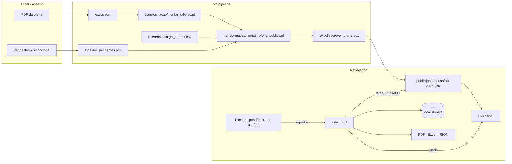

# Arquitetura

São duas partes independentes, ligadas por uma planilha por bimestre:

1. **Pipeline de dados** (local): lê o PDF da faculdade e gera `public/jobs/ofertas/<BIMESTRE>.xlsx`.
2. **Site estático** (`public/`, publicado no GitHub Pages): carrega essa planilha no navegador e monta a grade. Não tem backend.

## Pipeline (`src/pipeline`, `scripts/build-dados.sh`)

Os intermediários ficam em `data/interim/`, que não vai para o Git.

| Etapa | Script | Entrada → Saída |
|---|---|---|
| Extração | `extracao/extrair_celulas.pl` | PDF → `cols_<pág>.txt` (texto de cada célula dia × horário) |
| Extração | `extracao/ler_aulas.pl` | `cols_*.txt` → `aulas.csv` |
| Extração | `extracao/ler_digitais.pl` | `raw.txt` → `digitais.csv` |
| Transformação | `transformacao/montar_tabelas.pl` | → `f_aulas.tsv`, `f_dig.tsv`, `f_res.tsv` |
| Transformação | `transformacao/montar_oferta_publica.pl` | `f_*.tsv` + C.H. → `o_aulas.tsv`, `o_dig.tsv` (só colunas públicas) |
| Excel | `excel/escrever_oferta.ps1` | `o_*.tsv` → `public/jobs/ofertas/<BIMESTRE>.xlsx` |
| Excel | `excel/ler_pendentes.ps1` | (opcional) planilha pessoal → `ch.tsv` com mais C.H. |

**Como a extração acha dia e horário.** O `pdftotext` recorta a página com margens:

1. Por busca binária, acha a posição dos cabeçalhos (Segunda-feira … Sábado), do "INTERVALO" e de "ATIVIDADES DIGITAIS".
2. Recorta 6 colunas × 2 faixas de horário.

As páginas rodam em paralelo.

**O que fica de fora da oferta pública:**
- nome do representante de turma;
- cabeçalho do PDF, que traz nomes de alunos.

Os testes conferem isso. O código do Google Classroom de cada aula vai na coluna "Classroom" da oferta pública e aparece nos quadros, no PDF e no Excel.

## Site (`src/web` → `public/index.html`)

O `scripts/build-web.sh` junta o template, o CSS e os módulos JS num único `index.html`. Também gera o `public/jobs/ofertas/index.json` com os bimestres configurados e os que já têm planilha.

| Camada | Módulo | Responsabilidade |
|---|---|---|
| core | `util.js` | Ajudantes de DOM e texto |
| core | `dominio.js` | Ofertas e pendências carregadas em tempo de execução (`definirOfertas`, `definirPendencias`), turmas da mesma disciplina, **carga horária** |
| core | `estado.js` | Grade por bimestre, dados do aluno, `localStorage`, nomes de arquivo |
| io | `ofertas.js` | `index.json` e planilha do bimestre (fetch + SheetJS) |
| io | `pendencias.js` | Importação do Excel de pendências (coluna Código; STATUS opcional) e planilha modelo |
| io | `arquivos.js` | Exportar PDF (jsPDF) e Excel, salvar e carregar a grade |
| ui | `bimestre.js` | Escolha do bimestre e carregamento |
| ui | `filtros.js` | Curso, turma, código, busca; `montarFiltros()` e `renderAll()` |
| ui | `grade.js`, `seletor.js` | Quadro da semana e janela de escolha |
| ui | `pendencias.js`, `resumo.js`, `digitais.js`, `acoes.js` | Quadros da página e ações |
| — | `main.js` | Inicialização |

### Regras

- **Carga horária:** cada horário vale 15h, então `slotsNeeded = C.H. / 15`. A C.H. vem da coluna C.H. da oferta. Se faltar, vem da planilha de pendências. Se faltar também, é estimada pelo nº de encontros da turma e marcada como "(estimada)".
- **Oferta:** uma oferta é a mesma disciplina, dia, horário, sala e professor. Várias turmas podem dividir a mesma aula.
- **Opções do horário:** a disciplina some das opções de outro horário quando a C.H. já está completa.

## Publicação

O `.github/workflows/pages.yml` publica a pasta `public/` no GitHub Pages a cada push em `main` que mexa em `public/`.

## Testes

`scripts/testar.sh` roda o `tests/verificar_saidas.pl`, que confere:

- **Extração:** formato dos campos e nº de células igual ao nº de códigos no PDF.
- **Oferta pública:** só as colunas permitidas.
- **Site:** template completo e scripts balanceados.
- **Privacidade:** nenhum termo de `assets/dados-pessoais.txt`, uma lista local fora do Git, aparece nos arquivos versionados.
